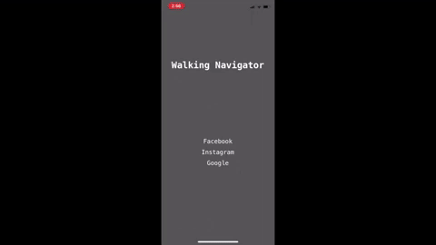

# WalkingNavigator
WalkingNavigator is an application that combines internet surfing, destination search, route planning, navigating, obstacle detection and avoidance, where obstacle detection is built by using [tensorflow object detection](https://github.com/tensorflow/models). The goal for WalkingNavigator is to help pedestrian walk safer and provide the functionality of browsing websites at the same time by providing voice/text navigation notification and obstacle alert (vibration in this application). When an obstacle is detected, the alarm will be triggered.

Currently, we have four classes for object detection which are cars, stairs, ped xing, and humans's leg. We choose these classes as obstacle since these objects are common that people will be stumbled or occur accident. You can also customized the object detection which described in this [section](#Training-Customized-Obstacles).

## Before Installing WalkingNavigator
Before running the code on IOS devieces, you have to build the tensorflow libraries for IOS. Following the instruction in [TensorFlow's Object Detection API](https://github.com/csharpseattle/tensorflowiOS).

## Training Customized Obstacles
* **Creating dataset**
  1. Label the customized data by using [labelImage](https://github.com/tzutalin/labelImg#macos) and you will get a bunch of .xml files.
  2. Convert all .xml files to one .csv by implementing [xml_to_csv.py](https://github.com/kwyuyu/Walking_Navigator/blob/master/xml_to_csv.py).
  3. Convert dataset to tfrecord by implementing [generate_tfrecord.py](https://github.com/kwyuyu/Walking_Navigator/blob/master/generate_tfrecord.py).
  4. Create a `label_map.pbtxt` file, an example can be found [here](https://github.com/kwyuyu/Walking_Navigator/blob/master/WalkingNavigatorApp/Models/walking_detection/mscoco_label_map.txt).

* **Training** 
  1. Download the [tensorflow models](https://github.com/tensorflow/models) and install all the [dependencies](https://github.com/tensorflow/models/blob/master/research/object_detection/g3doc/installation.md) for object detection.
  2. Use [pretrained model](https://github.com/tensorflow/models/blob/master/research/object_detection/g3doc/detection_model_zoo.md) is suggested.
  3. Modify `pipline.config`, especially the following items:
      * Train_input_reader:
        * Input_path: `/train.record`.
        * label_map_path: `/label_map.pbtxt`.
      * Eval_config:
        * num_examples: number of batch or total size of eval dataset.
      * Eval_input_reader:
        * Input_path: `/eval.record`.
      	* label_map_path: `/label_map.pbtxt`.
      * Num_classes
      * Fine_tune_checkpoint: path to pretrained model, ie. `/pretrained/model.ckpt`.
  4. Run locally or run on other platform, [link](https://github.com/tensorflow/models/tree/master/research/object_detection/g3doc).
  5. Export the model, [link](https://github.com/tensorflow/models/blob/master/research/object_detection/g3doc/exporting_models.md).
 
## Demo

  

A full version of demo video can be found in [Demo video](https://www.youtube.com/watch?v=3JGynUHVRZo&feature=youtu.be).

## Reference
* [Tensorflow iOS Object Detection](https://github.com/csharpseattle/tensorflowiOS).
* [TensorFlow Models](https://github.com/tensorflow/models).
* [How to train your own Object Detector with TensorFlow’s Object Detector API](https://towardsdatascience.com/how-to-train-your-own-object-detector-with-tensorflows-object-detector-api-bec72ecfe1d9).
